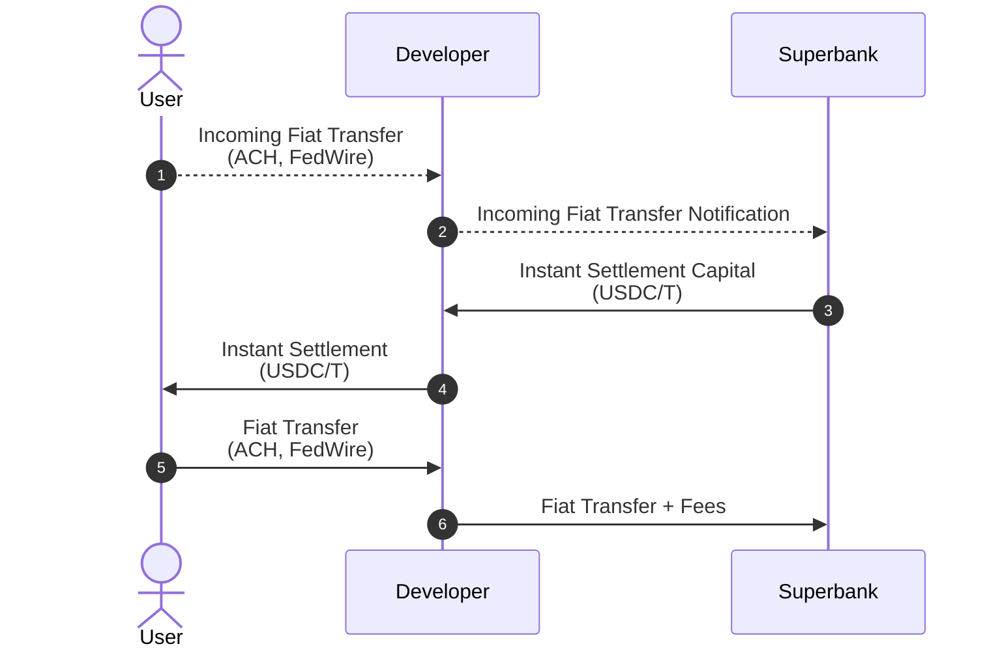
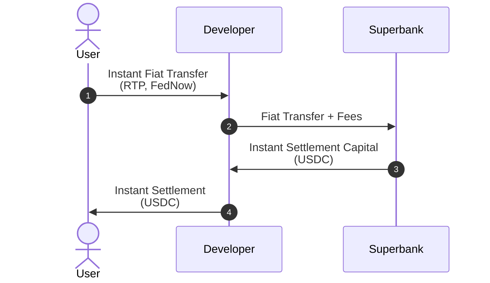
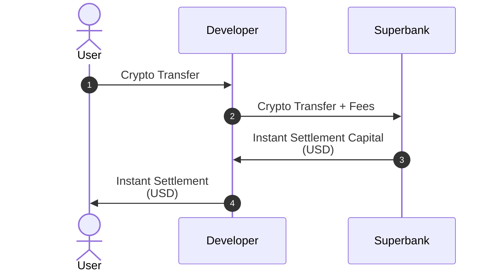

## Roles

- **Developer** - The company or entity using Superbank.
- **User** - The end-user of a Developer.

## On-Ramping

<Tip>
  Why is there a difference between legacy and instant rails when on-ramping?

  On-ramping is affected by two liquidity gaps:

  - Real-time transfers: Instant rails like RTP require pre-funding;
  - Real-time settlement: Real-time on-chain settlement requires access to USDC reserves.

  Superbank provides access to both pre-funded instant rails and USDC liquidity reserves:

  - If User cannot use instant rails, Superbank enables real-time settlement of legacy rails.
  - If User can use RTP, Superbank provides the necessary pre-funding for instant transfers, as well as USDC liquidity for real-time on-chain settlement.
  - If User can use FedNow, Superbank provides the necessary USDC liquidity for real-time on-chain settlement.
</Tip>

### On-Ramping with Legacy Rails

<Steps>
  <Step> 
    User initiates Fiat Transfer to Developer via legacy rails (ACH, FedWire). 

      - `source`: User’s bank account
      - `destination`: Developer’s bank account

    <Badge icon="clock" color="blue">T0</Badge>
  </Step>
  <Step>
    Developer forwards Incoming Fiat Transfer Notification to Superbank.

      - `source`: Developer’s bank account
      - `destination`: Superbank’s API
  </Step>
  <Step>
    Superbank provides Instant Settlement Capital to Developer in USDC/T.

      - `source`: Superbank’s pre-funded wallet
      - `destination`: Developer’s wallet
  </Step>
  <Step>
    Developer forwards Instant Settlement Capital to User.

      - `source`: Developer’s wallet
      - `destination`: User’s wallet

    <Badge icon="clock" color="blue">T0</Badge> &nbsp;&nbsp; <Badge icon="circle-check" color="green">INSTANT SETTLEMENT</Badge>
  </Step>
  <Step>
    Fiat Transfer from User to Developer is completed after T + X.

      - `source`: User’s bank account
      - `destination`: Developer’s bank account

    <Badge icon="clock" color="blue">T0 + X</Badge>
  </Step>
  <Step>
    Developer forwards received Fiat Transfer funds + Fees to Superbank. 
      - `source`: Developer’s bank account
      - `destination`: Superbank’s bank account

    <Badge icon="clock" color="blue">T0 + X</Badge>
  </Step>
</Steps>

### On-Ramping with Instant Rails

<Steps>
  <Step> 
    User completes Fiat Transfer to Developer via instant rails (RTP, FedNow).

      - `source`: User’s bank account
      - `destination`: Developer’s bank account
    
    <Badge icon="clock" color="blue">T0</Badge>
  </Step>
  <Step> 
    Developer forwards received Fiat Transfer funds + Fees to Superbank.

      - `source`: Developer’s bank account
      - `destination`: Superbank’s bank account
  </Step>
  <Step> 
    Superbank provides Instant Settlement Capital to Developer in USDC/T.
    
      - `source`: Superbank’s pre-funded wallet
      - `destination`: Developer’s wallet
  </Step>
  <Step>
    Developer forwards Instant Settlement Capital to User. 

      - `source`: Developer’s wallet
      - `destination`: User’s wallet

    <Badge icon="clock" color="blue">T0</Badge> &nbsp;&nbsp; <Badge icon="circle-check" color="green">INSTANT SETTLEMENT</Badge>
  </Step>
</Steps>

## Off-Ramping

<Tip>
  Why is there no difference between legacy and real-time rails when off-ramping?

  Off-ramping is affected by two liquidity gaps:

  - Real-time settlement: Instant off-chain settlement requires access to USD reserves.
  - Real-time transfers: Instant rails like RTP require pre-funding;

  Superbank provides access to both pre-funded instant rails and USD liquidity reserves, eliminating the need for legacy rails.

  - If Developer cannot use instant rails, Superbank provides both RTP and FedNow.
  - If Developer can use RTP, Superbank provides the necessary pre-funding for instant transfers, as well as USD liquidity for instant off-chain settlement.
  - If Developer can use FedNow, Superbank provides the necessary USD liquidity for off-chain settlement.
  - If User cannot receive instant transfers, Superbank provides Same Day ACH fallback.
</Tip>

### Off-Ramping with Instant and Legacy Rails

<Steps>
  <Step> 
    User completes Crypto Transfer to Developer.

      - `source`: User’s wallet
      - `destination`: Developer’s wallet

    <Badge icon="clock" color="blue">T0</Badge>
  </Step>
  <Step> 
    Developer forwards received Crypto Transfer funds + Fees to Superbank.

      - `source`: Developer’s wallet
      - `destination`: Superbank’s wallet
  </Step>
  <Step> 
    Superbank provides Instant Settlement Capital to Developer in USD.

      - `source`: Superbank’s pre-funded bank account
      - `destination`: Developer’s bank account
  </Step>
  <Step>
    Developer forwards Instant Settlement Capital to User.

      - `source`: Developer’s bank account
      - `destination`: User’s bank account

    <Badge icon="clock" color="blue">T0</Badge> &nbsp;&nbsp; <Badge icon="circle-check" color="green">INSTANT SETTLEMENT</Badge>
  </Step>
</Steps>