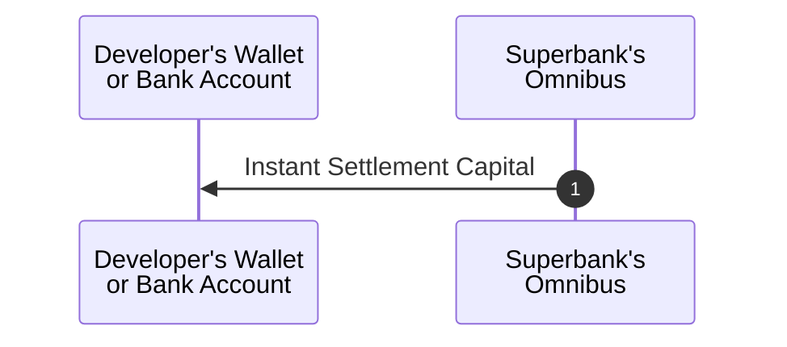
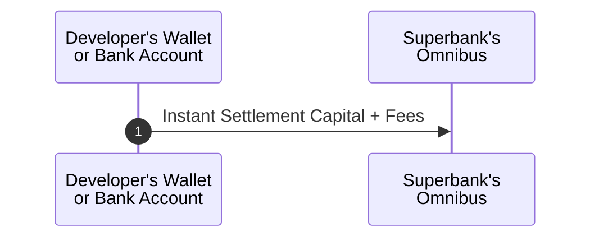

## Roles

- **Developer** - The company or entity using Superbank.
- **User** - The end-user of a Developer.

## On/Off-Ramping

### Introduction

<Tip>
  TL;DR

  1. Superbank pre-positions liquidity with the developer to support real-time settlement.
  2. User transactions run in a continuous loop where each request is settled instantly using the pre-positioned liquidity while fiat transfers complete asynchronously.
  3. On a scheduled interval (e.g. daily, weekly, monthly), utilized liquidity is netted, returned, and fees are settled.
</Tip>

The on- and off-ramping flow **enables real-time settlement by decoupling user payment finality from blockchain settlement.**

Superbank temporarily provisions liquidity to the developer, allowing the developer to settle user balances in real time for both on- and off-ramp transactions while underlying fiat transfers complete asynchronously.

Once user transactions settle, the pre-positioned liquidity is reconciled and returned to Superbank along with applicable fees.

### Step 1: Capital Provisioning

In this phase, Superbank transfers a predefined amount of instant settlement capital to the developer’s on-chain wallet or bank account. This capital serves as a temporary liquidity buffer that the developer can draw on to settle user on-ramp transactions immediately:

- The provisioned capital is segregated and used exclusively for instant on/off-ramping, ensuring clear accounting and reconciliation;
- No user transactions occur during this phase; capital is positioned in advance to guarantee availability when requests arrive.

### Step 2: Real-Time Settlement

#### On-Ramping

When a user initiates an on-ramping request, the following loop applies:

1. The user requests conversion from fiat to on-chain assets;
2. The developer’s system authorizes instant settlement to the user’s wallet using pre-positioned liquidity;
3. The corresponding fiat transfer is initiated and observed asynchronously;
4. Liquidity is temporarily utilized during execution and restored during reconciliation.

This execution model provides real-time settlement while underlying transfers complete asynchronously.

<Frame caption="Click to zoom in.">
	
</Frame>

#### Off-Ramping

When a user initiates an off-ramping request, the following loop applies:

1. The user requests conversion from on-chain assets to fiat;
2. The developer’s system authorizes instant settlement to the user’s bank account using pre-positioned liquidity;
3. The corresponding on-chain transfer is initiated and observed asynchronously;
4. Liquidity is temporarily utilized during execution and restored during reconciliation.

This execution model provides real-time settlement while underlying transfers complete asynchronously.

<Frame caption="Click to zoom in.">
	
</Frame>

### Step 3: Capital Reconciliation

After on- and off-ramp transactions have reached payment finality, the developer returns the utilized instant settlement capital to Superbank. Alongside the principal, the developer pays agreed-upon fees for the use of the pre-positioned liquidity:

- Reconciliation restores Superbank’s liquidity position and ensures accurate accounting across all parties;
- Settlement occurs on a defined interval (e.g. daily, weekly, monthly), allowing multiple transactions to be netted and settled together.

