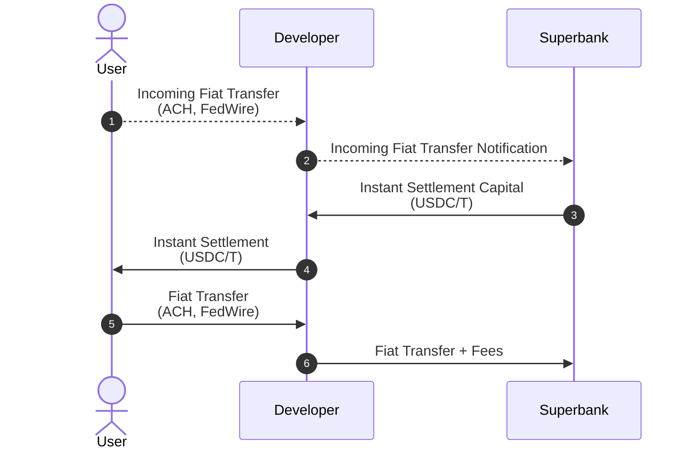
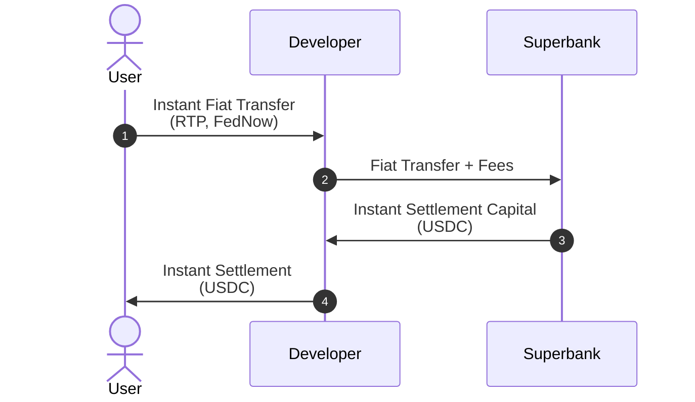
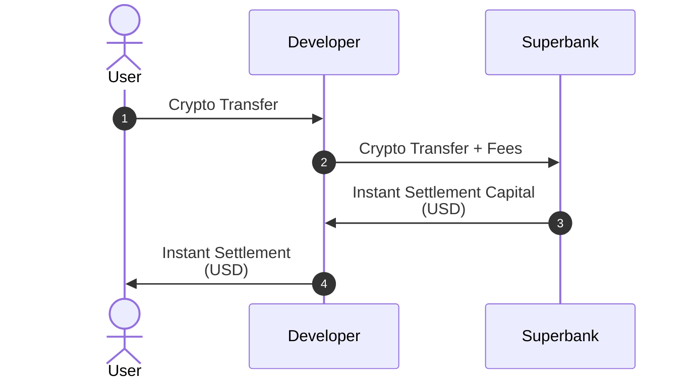

<Info>
  **Roles**

  - **Developer** - The company or entity using Superbank.
  - **User** - The end-user of a Developer.
</Info>

## On-Ramping

<Tip>
  **Why is there a difference between legacy and instant rails when on-ramping?**

  On-ramping is affected by two liquidity gaps:

  - Real-time transfers: Instant rails like RTP require pre-funding;
  - Real-time settlement: Real-time on-chain settlement requires access to USDC reserves.

  Superbank provides access to **both pre-funded instant rails and USDC liquidity reserves**:

  - If User cannot use instant rails, Superbank enables real-time settlement of legacy rails.
  - If User can use RTP, Superbank provides the necessary pre-funding for instant transfers, as well as USDC liquidity for real-time on-chain settlement.
  - If User can use FedNow, Superbank provides the necessary USDC liquidity for real-time on-chain settlement.
</Tip>

### On-Ramping with Legacy Rails

1. User initiates Fiat Transfer to Developer via legacy rails (ACH, FedWire). = T0
   1. `source`: User’s bank account
   2. `destination`: Developer’s bank account
2. Developer forwards Incoming Fiat Transfer Notification to Superbank.
   1. `source`: Developer’s bank account
   2. `destination`: Superbank’s API
3. Superbank provides Instant Settlement Capital to Developer in USDC/T.
   1. `source`: Superbank’s pre-funded wallet
   2. `destination`: Developer’s wallet
4. Developer forwards Instant Settlement Capital to User. = T0
   1. `destination`: User’s wallet
5. Fiat Transfer from User to Developer is completed after T + X (initiated in Step 1). = T0 + X
   1. `source`: User’s bank account
   2. `destination`: Developer’s bank account
6. Developer forwards received Fiat Transfer funds + Fees to Superbank. = T0 + X
   1. `source`: Developer’s bank account
   2. `destination`: Superbank’s bank account

### On-Ramping with Instant Rails

1. User completes Fiat Transfer to Developer via instant rails (RTP, FedNow). **[T0]**
   1. `source`: User’s bank account
   2. `destination`: Developer’s bank account
2. Developer forwards received Fiat Transfer funds + Fees to Superbank.
   1. `source`: Developer’s bank account
   2. `destination`: Superbank’s bank account
3. Superbank provides Instant Settlement Capital to Developer in USDC/T.
   1. `source`: Superbank’s pre-funded wallet
   2. `destination`: Developer’s wallet
4. Developer forwards Instant Settlement Capital to User. **[T0]** **[INSTANT SETTLEMENT]**
   1. `source`: Developer’s wallet
   2. `destination`: User’s wallet

## Off-Ramping

<Tip>
  **Why is there no difference between legacy and real-time rails when off-ramping?**

  Off-ramping is affected by two liquidity gaps:

  - Real-time settlement: Instant off-chain settlement requires access to USD reserves.
  - Real-time transfers: Instant rails like RTP require pre-funding;

  Superbank provides access to **both pre-funded instant rails and USD liquidity reserves, eliminating the need for legacy rails.**

  - If Developer cannot use instant rails, Superbank provides both RTP and FedNow.
  - If Developer can use RTP, Superbank provides the necessary pre-funding for instant transfers, as well as USD liquidity for instant off-chain settlement.
  - If Developer can use FedNow, Superbank provides the necessary USD liquidity for off-chain settlement.
  - If User cannot receive instant transfers, Superbank provides Same Day ACH fallback.
</Tip>

### Off-Ramping with Instant and Legacy Rails

1. User completes Crypto Transfer to Developer. **[T0]**
   1. `source`: User’s wallet
   2. `destination`: Developer’s wallet
2. Developer forwards received Crypto Transfer funds + Fees to Superbank.
   1. `source`: Developer’s wallet
   2. `destination`: Superbank’s wallet
3. Superbank provides Instant Settlement Capital to Developer in USD.
   1. `source`: Superbank’s pre-funded bank account
   2. `destination`: Developer’s bank account
4. Developer forwards Instant Settlement Capital to User. **[T0]** **[INSTANT SETTLEMENT]**
   1. `source`: Developer’s bank account
   2. `destination`: User’s bank account