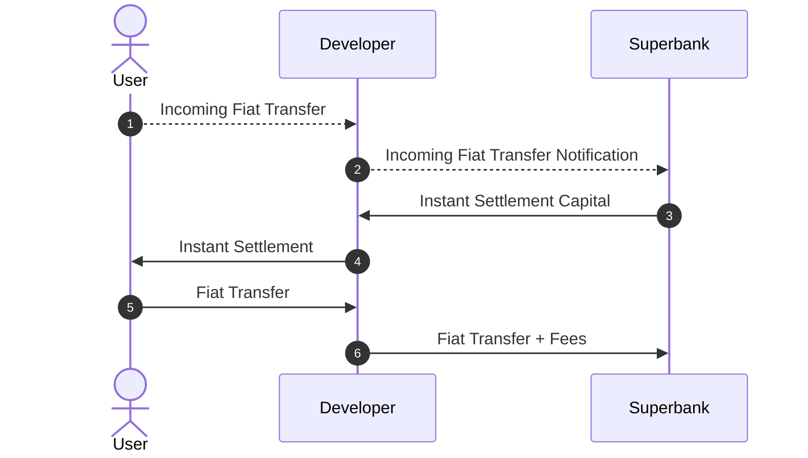

<Info>
  **Roles**

  - **Developer** - The company or entity using Superbank.
  - **User** - The end-user of a Developer.
</Info>

## On-Ramping

<Tip>
  **Why is there a difference between legacy and instant rails when on-ramping?**

  On-ramping is affected by two liquidity gaps:

  - Real-time transfers: Instant rails like RTP require pre-funding;
  - Real-time settlement: Real-time on-chain settlement requires access to USDC reserves.

  Superbank provides access to **both pre-funded instant rails and USDC liquidity reserves**:

  - If User cannot use instant rails, Superbank enables [real-time settlement of legacy rails](https://www.notion.so/Superbank-Developer-Guide-2c22ae4aca0080c2848ced94b2c312dd?pvs=21).
  - If User can use RTP, Superbank provides the necessary pre-funding for instant transfers, as well as USDC liquidity for [real-time on-chain settlement](https://www.notion.so/Superbank-Developer-Guide-2c22ae4aca0080c2848ced94b2c312dd?pvs=21).
  - If User can use FedNow, Superbank provides the necessary USDC liquidity for [real-time on-chain settlement](https://www.notion.so/Superbank-Developer-Guide-2c22ae4aca0080c2848ced94b2c312dd?pvs=21).
</Tip>

### On-Ramping with Legacy Rails

````mermaid

````